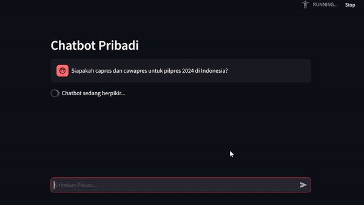
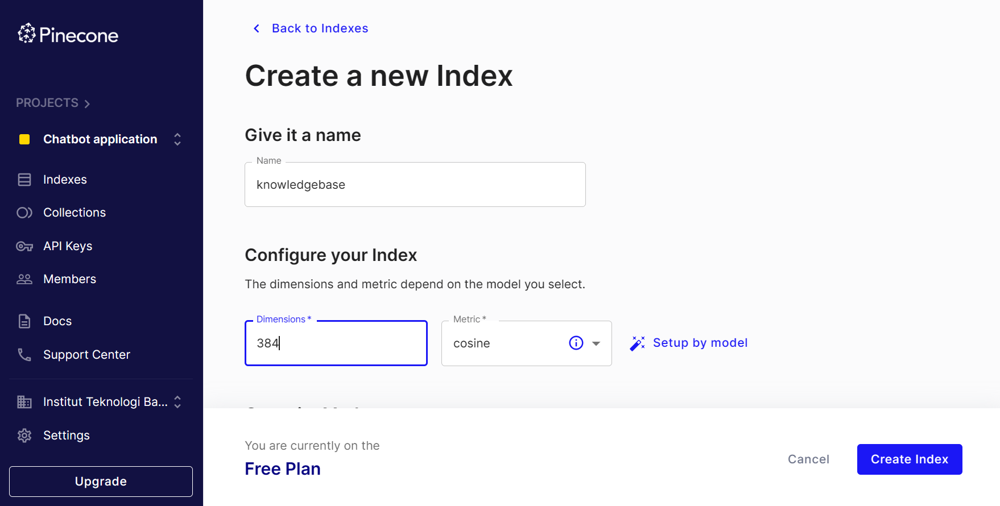
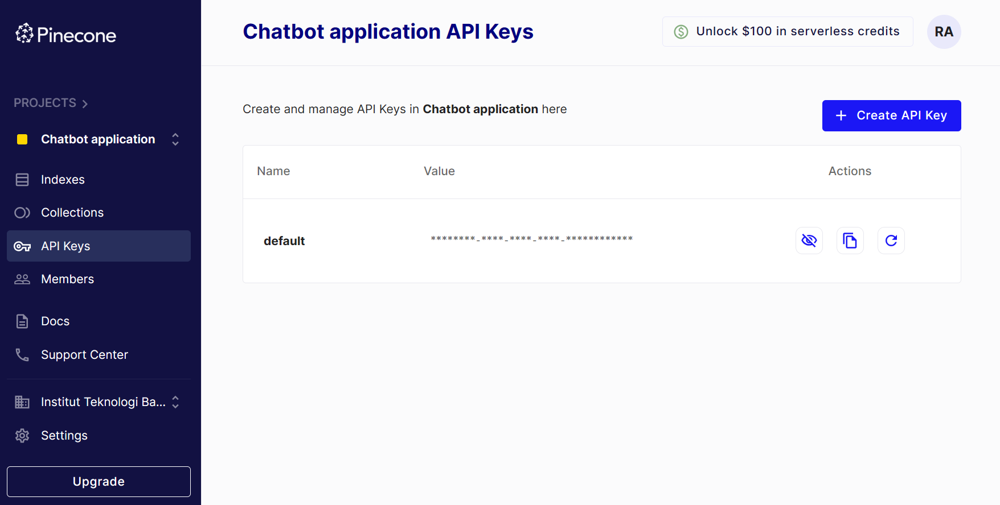

## Overview
This repository contains the code and resources to create a chatbot using Llama 2 as the Large Language Model, Pinecone as the Vector Store for efficient similarity search, and Streamlit for building the user interface.

## Table of Contents
- [Introduction](#introduction)
- [Features](#features)
- [Requirements](#requirements)
- [Installation](#installation)
- [Usage](#usage)
- [Knowledge Base Improvement](#knowledge-base-improvement)
- [Chatbot Interaction](#chatbot-interaction)
- [Extras](#extras)
- [Exceptional Inspirations](#exceptional-inspirations)

## Introduction
This project aims to showcase the integration of technologies to build an intelligent and interactive chatbot that runs locally. The main focus is to take advantage of the Llama 2 as open source Large Language Model developed by Meta AI as introduced in [their website](https://ai.meta.com/llama/).

While building with Llama 2, this repository is intended to leverage its factual accuracy and consistency by providing it with reliable and up-to-date information from the knowledge base. Achieving this involves the model with an external database that could be used to store such novel information. 

In order to keep it as simple as it goes, this repository focuses solely on meeting the outlined objectives without delving into alternative technologies that would certainly complement the project but are outside its specific scope. 

## Features
- **LangChain**: A specialized framework designed for developping language model applications, providing seamless integration with the powerful Llama 2 model. The framework offers off-the-shelf chains for easy initiation as well as customizable components for tailoring existing chains or building new ones. The LangChain libraries themselves are made up of several different packages, with `langchain_community` serving as a hub for third party integrations. Within this package, `llama-cpp-python` is particularly relevant for the specific purpose of this repository. It acts as a Python binding for `llama.cpp` and supports inference for many Llama 2 models.
- **Pinecone**: Leverage Pinecone as a Vector Store for efficient similarity search and retrieval of contextually relevant responses. Pinecone runs serverless that lets you deliver remarkable chatbot applications with a certain number of advantages. It has power to search across billions of embeddings with ultra-low query latency. You can get started for free, then upgrade and scale as needed.
- **Streamlit**: Build a user-friendly interface using Streamlit, allowing users to interact seamlessly with the chatbot. No front-end experience required. It's the UI powering Large Language Model movement. That means GenAI and Streamlit: A perfect match.

## Requirements
To set up the project, follow these steps:
1. Create a dedicated directory for the purpose of this project using your preferred file manager or command-line interface.
2. It's always a best practice to create a virtual environment to manage dependencies for your project which you can decide to give the name arbitrarily. I personally name it `llm_env` in my project. Please make sure that you already have Python installed, preferably with a version above 3.9.x or higher in order to get along with this. Open the terminal and navigate to the project directory you have provided. Run this command to create a virtual environment.

    ```bash
    python -m venv llm_env 
    ```

3. Activate the virtual environment after it's done created.
    - On Windows:

        ```bash
        llm_env\Scripts\activate
        ```

    - On Unix or MacOS:

        ```bash
        source llm_env\bin\activate
        ```

4. Download `requirements.txt` file provided in this repository and navigate to the directory where the file is located. Then, install all dependencies included by running this command.

   ```bash
   pip install -r requirements.txt
   ```

   Libraries:
   
    <br>
    <br>
    <br>
    <br>
    <br>
    <br>
    <br>
    <br>
    <br>

## Installation
Llama 2 comes with various flavors that could be regarded as a family of state-of-the-art open-access Large Language Model. It's available with 12 open-access models with detailed of 3 base models and 3 fine-tuned ones with the original Meta checkpoints, plus their corresponding transformer models. Please go find more information about it on [Hugging Face](https://huggingface.co/meta-llama). In order to install the Llama 2 model, you need to follow these steps:
1. Download one of GGML version model of Llama 2 on [Hugging Face Repository](https://huggingface.co/localmodels/Llama-2-7B-Chat-ggml/tree/main). I personally choose `llama-2-7b-chat.gguf.q2_K` version as the foundational model that runs locally. You can choose whichever model that you want.

    **Note**: GGML is a machine learning library designed specifically to handle large models efficiently and deliver high performance on standard hardware. It employs a quantized representation of model weights, meaning it utilizes approximated parameters instead of full version. While this may result in a slight reduction in accuracy, the significant trade-off is evident in the resource efficiency it offers. This makes GGML an ideal starting point for most local machines, particularly those not equipped with GPUs for machine learning or with limited RAM.

2. Once downloaded, the GGML version needs to be converted to GGUF as proposed in [this discussion](https://github.com/abetlen/llama-cpp-python/pull/633). This conversion is considered a breaking change to model files that work with `llama.cpp`. Download `convert-llama-ggml-to-gguf.py` file provided in this repository.
3. Move the `convert-llama-ggml-to-gguf.py` script directly to the directory where the GGML version model is located.
4. Run this command on command-line interface.

   ```bash
   python convert-llama-ggml-to-gguf.py --eps 1e-5 --input llama-2-7b-chat.ggmlv3.q2_K.bin --output llama-2-7b-chat.gguf.q2_K.bin
   ```

    **Note**: Change the name of GGML version model in the script input to the one you have downloaded. Then, specify an arbitrary name for the GGUF version model as the script output.
 
## Usage
The chatbot application in this repository is designed to behave as an intelligent and interactive assistant, providing insightful replies to a wide range of queries. Leveraging the capabilities of the Llama 2 open-access models, the chatbot aims to offer valuable assistance in various domains. By this, we should be able to know how to prompt the models as well as how to change the system prompt. You can actually get to know about it through this release of [Hugging Face Blog](https://huggingface.co/blog/llama2#how-to-prompt-llama-2). 

The prompt template for the first turn looks like this:

```text
<s>[INST] <<SYS>>
{{ system_prompt }}
<</SYS>>

{{ user_message }} [/INST]
```

This template follows the model's training procedure as described in [Llama 2 Paper](https://huggingface.co/papers/2307.09288). We can use any system prompt we want, but it's crucial that the format matches the one used during training. Simple usage of the Llama 2 model has been provided on [this notebook](simple_usage.ipynb).

```python
from langchain.callbacks.manager import CallbackManager
from langchain.callbacks.streaming_stdout import StreamingStdOutCallbackHandler
from langchain_community.llms.llamacpp import LlamaCpp

# Establish callback to LLM for logging, monitoring, streaming and other tasks
callback_manager = CallbackManager(
    handlers=[StreamingStdOutCallbackHandler()]
)

llm = LlamaCpp(
    model_path='llama-2-7b-chat.gguf.q2_K.bin',
    callback_manager=callback_manager,
    verbose=True,
    streaming=True
)

system_prompt = "You are respectful and helpful assistant."
user_prompt = "What is Llama 2 model?"

input_prompt = \
f"""<s>[INST] <<SYS>>
{system_prompt}
<</SYS>>

{user_prompt} [/INST]
"""

print("\nINPUT:\n" + input_prompt + '\nANSWER:')

llm.invoke(
    input=input_prompt
)
```

## Knowledge Base Improvement
As outlined in the introduction section, the primary objective of this repository is to enhance the accuracy of the Llama 2 model when providing answers to questions related to contexts outside its training data. To achieve this, we integrate the Llama 2 model with Pinecone, serving as an index database to store additional information that may not be present in Llama 2's knowledge base.

As part of our research, we have included trending and hot topics related to Indonesia's 2024 general election on this repository from `external_data` folder. It's important to note that this information is beyond Llama 2's knowledge, and we leverage Pinecone to store and retrieve this curated content. The information provided is reliable and maintains a neutral stance, avoiding any tendencies toward specific political choices.

```text
Registration stages for presidential and vice-presidential candidates for 2024 Indonesia’s general election
ended on October 25th, 2023. The general election will be held simultaneously throughout Indonesia on
February 14th, 2024. There are three pairs of presidential and vice-presidential candidates having
registered with Komisi Pemilihan Umum (KPU). Here’s the list of candidate pairs:

Candidate pair number 1 are Anies Rasyid Baswedan as presidential candidate and Abdul Muhaimin
Iskandar as vice presidential candidate. They were promoted by Partai Nasional Demokrat (Nasdem),
Partai Kebangkitan Bangsa (PKB), and Partai Keadilan Sejahtera (PKS). They registered with KPU on
October 19th, 2023.

Candidate pair number 2 are Prabowo Subianto as presidential candidate and Gibran Rakabuming Raka
as vice presidential candidate. They were promoted by Partai Gerakan Indonesia Raya (Gerindra), Partai
Golongan Karya (Golkar), Partai Demokrat (Demokrat), Partai Amanat Nasional (PAN), Partai Solidaritas 
Indonesia (PSI), Partai Gelombang Rakyat Indonesia (Gelora), Partai Bulan Bintang (PBB), Partai Rakyat
Adil Makmur (Prima), and Partai Garda Perubahan Indonesia (Garuda). They registered with KPU on
October 19th, 2023.

Candidates number 3 are Ganjar Pranowo as presidential candidate and Mahfud MD as vice presidential
candidate. They were promoted by Partai Demokrasi Indonesia Perjuangan (PDIP), Partai Persatuan
Pembangunan (PPP), Partai Persatuan Indonesia (Perindo), and Partai Hati Nurani Rakyat (Hanura). They
registered with KPU on October 25th, 2023.
```

To store additional information above and leverage Pinecone as an index database, you'll need to have a Pinecone account. If you don't have one yet, please go directly to [this link](https://app.pinecone.io/?sessionType=signup) to sign up for free. Once registered, you can log in to your Pinecone account and then will be directed to Pinecone dashboard, where you can create and manage indexes. Follow these steps to set up your Pinecone index:
1. In your Pinecone dashboard, navigate to `Indexes` section. Then, click on `Create Index` button.
2. I personally choose the Free Plan package to which you need to provide the following parameters for your index.
    - **Name**: Give your index a name. You can choose an arbitrary name that makes sense for your project.
    - **Dimension**: Set the dimension for your index. You can look up the sentence transformer used when encoding the texts. Simply check out [this notebook](sentence_transformer_dimension.ipynb) on how to know the dimension of your sentence transformer.

      ```python
      from sentence_transformers import SentenceTransformer
    
      sentence_transformer = SentenceTransformer(
          model_name_or_path='all-MiniLM-L6-v2'
      )

      text = "When will Indonesia's general election be held?"
    
      input_encoded = sentence_transformer.encode(
          sentences=text
      ).tolist()
    
      print('Dimension:', len(input_encoded))
      ```

    - **Metric**: For similarity search, use cosine metric.

    

3. Once index created, navigate to `API Keys` section. Then, copy API key provided by Pinecone for your account.

    

4. Create a `.env` file in your project directory to store information related to your Pinecone account and index.

   ```env
   PINECONE_API_KEY=PUT YOUR API KEY HERE
   PINECONE_INDEX_NAME=PUT YOUR INDEX NAME HERE
   ```

5. Store the additional information into Pinecone index database by simply following the steps provided on [this notebook](pinecone_store_index.ipynb).
    ```python
    import os
    from dotenv import load_dotenv
    from pinecone import Pinecone
    from langchain.vectorstores import Pinecone as vec_storer
    from langchain.embeddings import SentenceTransformerEmbeddings
    from langchain_community.document_loaders import DirectoryLoader
    from langchain.text_splitter import RecursiveCharacterTextSplitter
    from sentence_transformers import SentenceTransformer
    
    loader = DirectoryLoader(
        path='external_data/'
    )
    
    documents = loader.load()
    
    text_splitter = RecursiveCharacterTextSplitter(
        chunk_size=2000,
        chunk_overlap=200
    )
    
    document_split = text_splitter.split_documents(
        documents=documents
    )
    
    load_dotenv()
    
    api_key = os.getenv(
        key='PINECONE_API_KEY'
    )
    
    index_name = os.getenv(
        key='PINECONE_INDEX_NAME'
    )
    
    Pinecone(
        api_key=api_key
    )
    
    embedding_model = SentenceTransformerEmbeddings(
        model_name='all-MiniLM-L6-v2'
    )
    
    vec_storer.from_documents(
        documents=document_split,
        embedding=embedding_model,
        index_name=index_name
    )

    sentence_transformer = SentenceTransformer(
        model_name_or_path='all-MiniLM-L6-v2'
    )
    
    input_encoded = sentence_transformer.encode(
        sentences="Who are presidential and vice-presidential candidates for Indonesia's general election?"
    ).tolist()
    
    pinecode_index = Pinecone(
        api_key=api_key
    ).Index(
        name=index_name
    )
    
    results = pinecode_index.query(
        vector=input_encoded,
        top_k=10,
        include_metadata=True
    )
    
    results['matches']
    ```

## Chatbot Interaction
Upon attempting to test the Llama 2 model's ability to provide factual and relevant responses to contextual query given by user, we can establish the real environment using `streamlit` library as chatbot UI. This library would ease our efforts in building chatbot application in just a matter of `pip install streamlit` and you're done. Now check out [their documentations](https://docs.streamlit.io/) to get along with it.

I have provided the application script on [this file](app.py) in case you want to try it out immediately. It's all in pure Python and no front-end experiences required, simply just by using their magically simple API. As for the back-end process, I have also provided [dedicated file](utils.py) on this repository to integrate with Llama 2 model and Pinecone index database.

You can directly run this command on command-line interface to have the chatbot application running locally.

```bash
streamlit run app.py
```

A few things you should consider in playing around with this application is that the Llama 2 model has default configuration that needs to reconfigure. For example, context length is set to 512 tokens which means the input tokens passed to the model must not exceed its value. This problem could be handled by altering the context length parameter to higher value such as 4096 tokens at maximum. You need to follow these steps in order to achieve this goal:
1. Use your text editor to open `llamacpp.py` file that can be found inside `site-packages` of your virtual environment, specifically on `llms` folder of `langchain_community` library distribution.
2. Change the parameter of `n_ctx` in line 44 to another (4096 at maximum).

    ```python
    ...
    
    n_ctx: int = Field(512, alias="n_ctx") # change context length here
    """Token context window."""

    ...
    ```

3. Then, save it.

## Extras
This chatbot application is already spun up and serves this repository objective. Considering the added context on Pinecone index database, I have conducted an experiment to add an extra feature that enables Indonesian language within the application. 

As of paper released about Llama 2 by Meta AI, the model was primarily trained on English with a bit of additional data from 27 other languages (see Table 10 on page 20 of the [Llama 2 paper](https://arxiv.org/abs/2307.09288). Still, it's not expected to have the same level of performance in other languages as in English. The good news is you can look at some of [community lead projects](https://hpc-ai.com/blog/one-half-day-of-training-using-a-few-hundred-dollars-yields-similar-results-to-mainstream-large-models-open-source-and-commercial-free-domain-specific-llm-solution) to fine-tune Llama 2 models to support other languages.

The limitation of Llama 2 model used in this repository project has come up with inability to process given query in other languages, besides English. That's why user must specify which language to use in chatbot options at first. To achieve this goal, we can use `easygoogletranslate` library that has an ability to translate the input query in other languages into English and translate it back to the language opted before feeding the response to user in the chatbot application. 

The modified codes could be seen as this:

```python
...

if user_input := streamlit.chat_input(
        placeholder=page_text[language][0]
    ):
        # Translate the query input if chosen language is Indonesian
        if language == 'Indonesian':
            processed_input = EasyGoogleTranslate(
                source_language='id',
                target_language='en'
            ).translate(
                text=user_input
            )
        else:
            processed_input = user_input

        streamlit.session_state.english.append(
            HumanMessage(
                content=processed_input
            )
        )

        streamlit.session_state.indonesian.append(
            HumanMessage(
                content=user_input
            )
        )

...

        # Running the model to get the answer in each session
        with streamlit.spinner(
            text=page_text[language][1]
        ):
            answer = get_answer(
                llm=llm,
                messages=streamlit.session_state.english
            )

        streamlit.session_state.english.append(
            AIMessage(
                content=answer
            )
        )

        # Translate the answer into Indonesian if language chosen is Indonesian
        if language == 'Indonesian':
            translated_answer = EasyGoogleTranslate(
                    source_language='en',
                    target_language='id'
                ).translate(
                    text=answer
                )

            streamlit.session_state.indonesian.append(
                AIMessage(
                    content=translated_answer
                )
            )

...
```

With this extension capability, Llama 2 model would still be able to process English-translated query with the help of `easygoogletranslate` library. While this solution provides a viable approach, it could have some drawbacks as it relies heavily on external library as well as the translation accuracy and latency. Hence, the advancement progress of this repository research must still go on.

## Exceptional Inspirations
This repository couldn't be made with the help of these blogs.
- [Building an Interactive Chatbot with Langchain, ChatGPT, Pinecone, and Streamlit](https://blog.futuresmart.ai/building-an-interactive-chatbot-with-langchain-chatgpt-pinecone-and-streamlit)
- [Implementing Locally-Hosted Llama2 Chat UI Using Streamlit](https://medium.com/@daydreamersjp/implementing-locally-hosted-llama2-chat-ui-using-streamlit-53b181651b4e)
